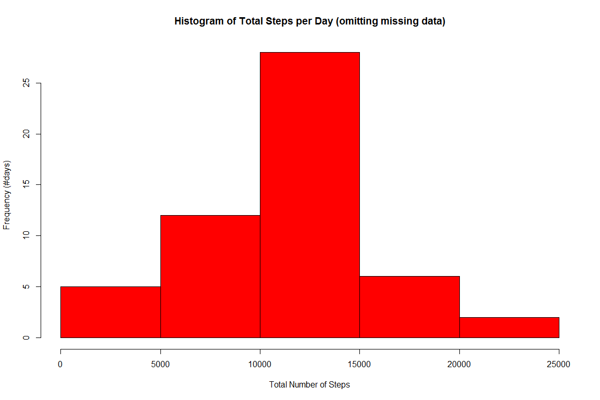
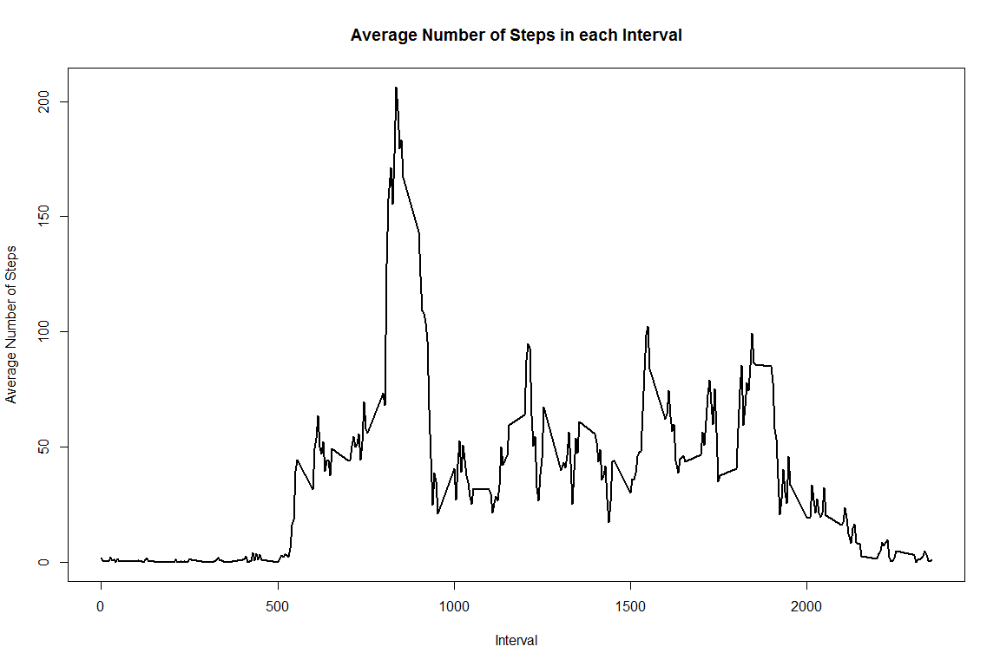
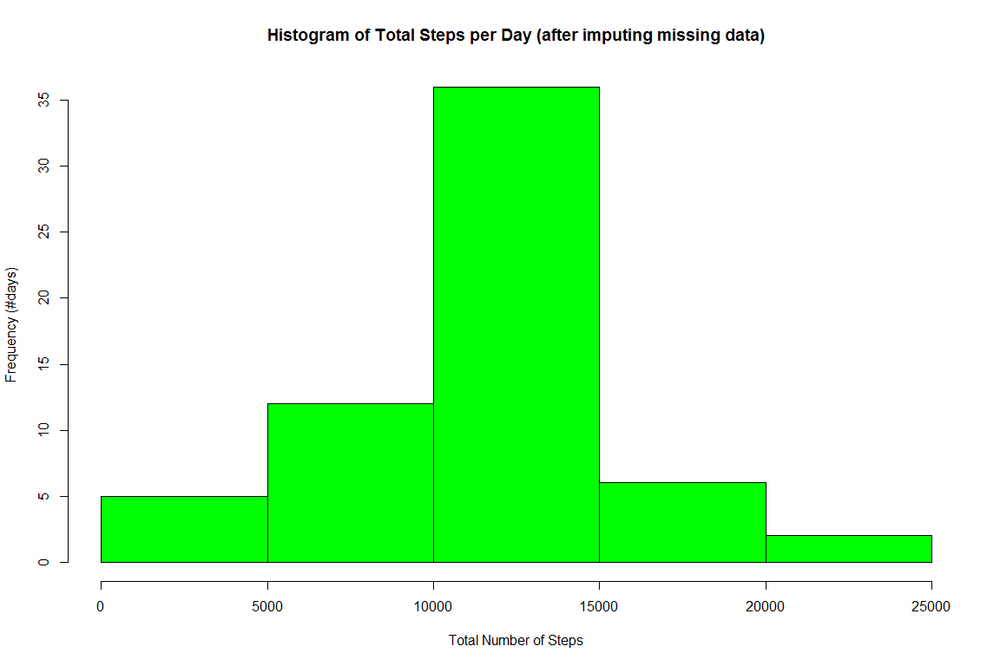
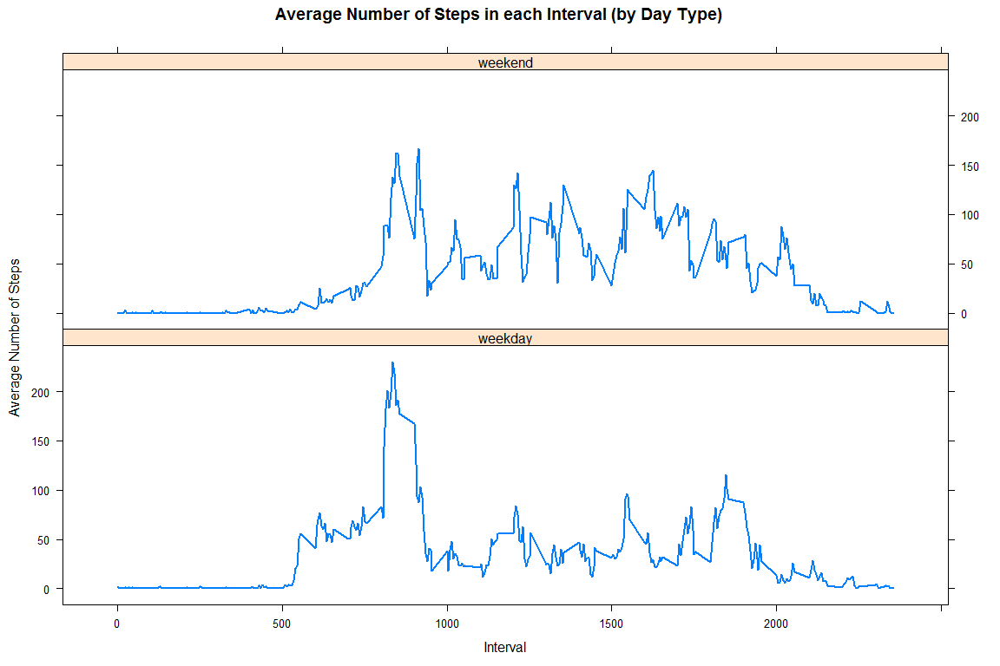

# Reproducible Research: Peer Assessment 1


## Loading and preprocessing the data
First load the activity data and typecast the column variables in the required format - steps as a numeric data type and interval as an integer.


```r
# Load the data
activity <- read.csv("activity.csv")
# Process/transform the data so that the data types for each column are appropriate 
activity$steps <- as.numeric(activity$steps)
activity$interval <- as.integer(activity$interval)
```

## What is mean total number of steps taken per day?
To address the questions in this section, first compute the total number of steps walked each day using the `aggregate` function in library `dplyr`.


```r
# Total number of steps taken per day
library(dplyr)
```

```
## 
## Attaching package: 'dplyr'
## 
## The following object is masked from 'package:stats':
## 
##     filter
## 
## The following objects are masked from 'package:base':
## 
##     intersect, setdiff, setequal, union
```

```r
stepsPerDay <- aggregate(activity$steps ~ activity$date, activity, sum, na.action=na.omit)
names(stepsPerDay) <- c("date","totalSteps")
```
Next plot a histogram of the total steps walked each day. For this plot, we are omitting the missing data.

```r
# Histogram of the total number of steps taken each day
hist(stepsPerDay$totalSteps,col="red",main="Histogram of Total Steps per Day (omitting missing data)", xlab="Total Number of Steps",ylab="Frequency (#days)")
```

 
The mean number of steps taken each day is 10766
and the median number of steps taken each day is 10765

```r
# Mean of total number of steps taken per day
print(avg <- mean(stepsPerDay$totalSteps))
```

```
## [1] 10766.19
```

```r
# Median of total number of steps taken per day
print(med <- median(stepsPerDay$totalSteps))
```

```
## [1] 10765
```

## What is the average daily activity pattern?
Again, using the `aggregate` function, compute the average number of steps taken in each 5-minute interval and plot the resulting time-series plot.

```r
# Time series plot of average number of steps taken per interval
stepsPerInterval <- aggregate(activity$steps ~ activity$interval, activity, mean, na.action=na.omit)
names(stepsPerInterval) <- c("interval","avgSteps")
plot(x=stepsPerInterval$interval,y=stepsPerInterval$avgSteps,type="l",lwd=2, main="Average Number of Steps in each Interval",xlab="Interval",ylab="Average Number of Steps")
```

 


```r
# 5-minute interval containing maximum average number of steps
m <- max(stepsPerInterval$avgSteps)
x<-filter(stepsPerInterval,stepsPerInterval$avgSteps==m)
x[1,1]
```

```
## [1] 835
```
From the code above, it was determined that the 5-minute interval **835** contains the maximum average number of steps which is 206.

## Imputing missing values

In the *activity* data set, there were a total of 2304 rows with missing (NA) values. The strategy used to fill the missing values is that they will be filled with the mean number of steps for that corresponding 5-minute interval because in some sense, a person's activities will be more or less similar at a given time of day every day. 

To impute the missing values, first make a copy of the *activity* dataframe and call the copy *newactivity*.

```r
# Create a new dataset that is the same as the original dataset but with missing values filled in
assign("newActivity",activity)
#identcial(newActivity,activity)
```
The imputing of the missing values was done using code suggested by [Hadley Wickham](http://www.mail-archive.com/r-help@r-project.org/msg58289.html) as given below. Since it is meaningful for the number of steps to be an integral quantity, the computed values for the missing values is rounded.

```r
library(plyr)
```

```
## -------------------------------------------------------------------------
## You have loaded plyr after dplyr - this is likely to cause problems.
## If you need functions from both plyr and dplyr, please load plyr first, then dplyr:
## library(plyr); library(dplyr)
## -------------------------------------------------------------------------
## 
## Attaching package: 'plyr'
## 
## The following objects are masked from 'package:dplyr':
## 
##     arrange, count, desc, failwith, id, mutate, rename, summarise,
##     summarize
```

```r
impute.mean <- function(x) replace(x, is.na(x), mean(x, na.rm = TRUE))
newActivity <- ddply(newActivity, ~ newActivity$interval, transform, steps = round(impute.mean(steps)))
newActivity <- newActivity[,2:4]
newActivity$interval <-as.integer(newActivity$interval)
newActivity <- newActivity[order(newActivity$date,newActivity$interval),]
rownames(newActivity) <- 1:nrow(newActivity)
```
As before we plot the histogram for the total number of steps taken each day after the missing values have been imputed.

```r
# Histogram of the total number of steps taken each day and their mean and median. 
newStepsPerDay <- aggregate(newActivity$steps ~ newActivity$date, newActivity, sum, na.action=na.omit)
names(newStepsPerDay) <- c("date","totalSteps")
hist(newStepsPerDay$totalSteps,col="green",main="Histogram of Total Steps per Day (after imputing missing data)", xlab="Total Number of Steps",ylab="Frequency (#days)")
```

 

```r
print(newAvg <- mean(newStepsPerDay$totalSteps))
```

```
## [1] 10765.64
```

```r
print(newMed <- median(newStepsPerDay$totalSteps))
```

```
## [1] 10762
```
The new mean number of steps taken per day is 10766 and the new median number of steps taken per day is 10762.

From the simple table below,

```r
imputing <- c("NO","YES")
meanVal <- c(round(avg),round(newAvg))
medianVal <- c(med, newMed)
print(sTable <- data.frame(imputing,meanVal,medianVal))
```

```
##   imputing meanVal medianVal
## 1       NO   10766     10765
## 2      YES   10766     10762
```
it can be seen that the rounded mean value is the same in the data with and without missing values, whereas the median got lowered in the data after the missing values were filled.

## Are there differences in activity patterns between weekdays and weekends?
To determine whether there are any differences in the activity patterns between weekdays and weekends, first a new factor variable had to be computed that labeled each day either as a *weekday* or a *weekend*. 

```r
# Create a new factor variable "dayType" that stores whether it is a weekend or weekday in the data set with the filled in missing values
library(lubridate)
```

```
## 
## Attaching package: 'lubridate'
## 
## The following object is masked from 'package:plyr':
## 
##     here
```

```r
newActivity$dayType <- ifelse(wday(as.Date(newActivity$date)) > 1&wday(as.Date(newActivity$date)) < 7,"weekday", "weekend")
newStepsPerInterval <- aggregate(newActivity$steps ~ newActivity$interval + newActivity$dayType, newActivity, mean)
names(newStepsPerInterval) <- c("interval","dayType","avgSteps")
```
A two panel plot, one for weekend and one for weekday, is plotted of the average number of steps taken in each interval.

```r
library(lattice)
xyplot(newStepsPerInterval$avgSteps ~ newStepsPerInterval$interval|newStepsPerInterval$dayType,layout=c(1,2),type="l", lwd=2, xlab="Interval", ylab="Average Number of Steps", main="Average Number of Steps in each Interval (by Day Type)")
```

 
